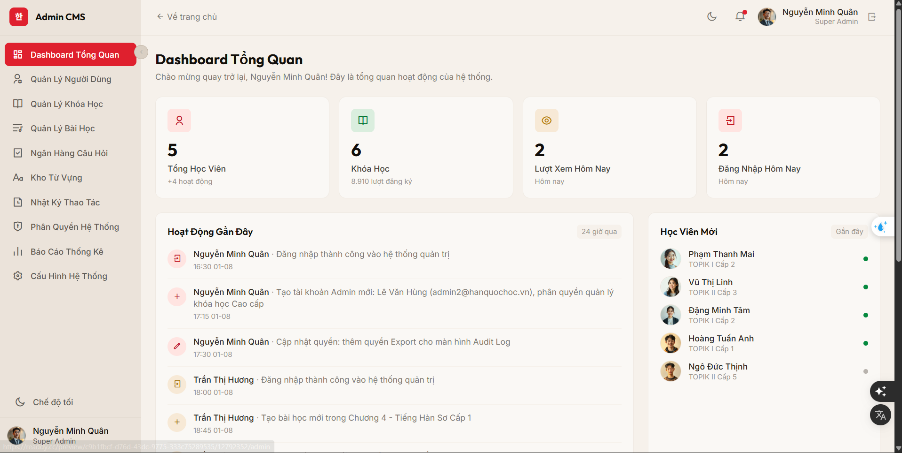
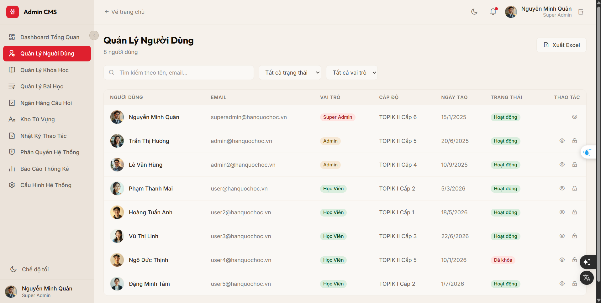
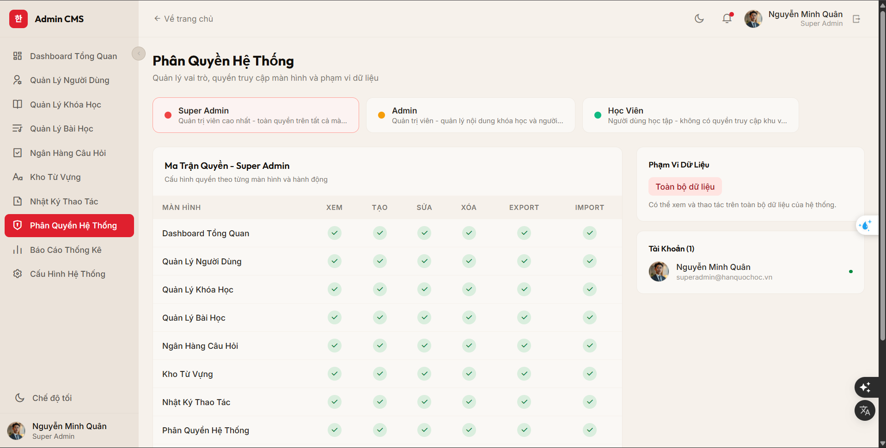
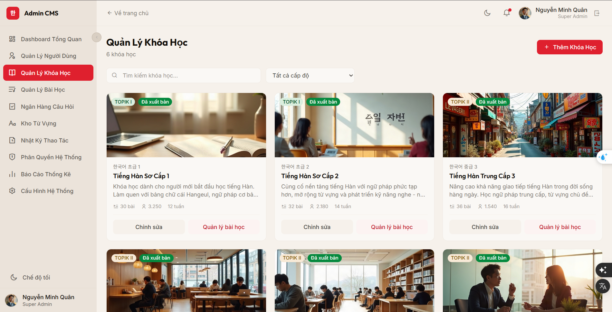
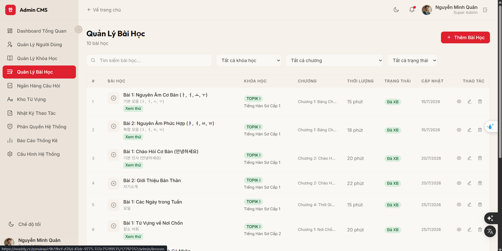
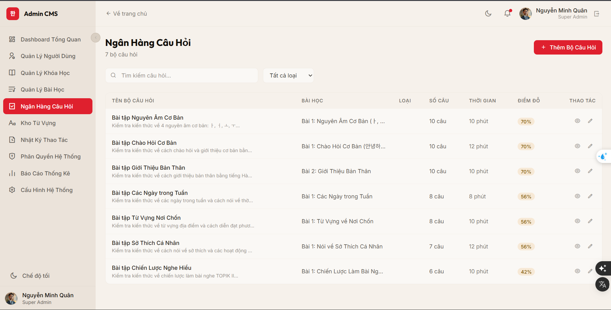
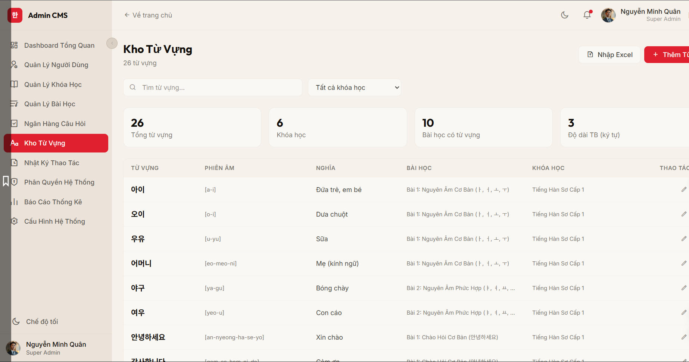
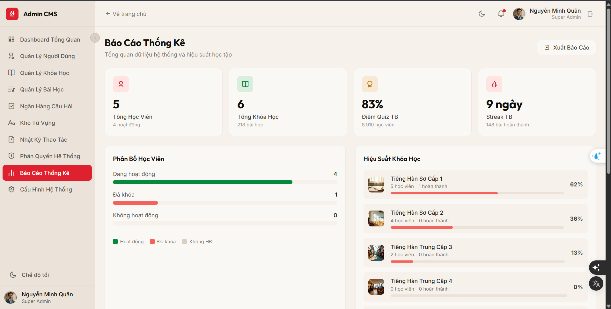
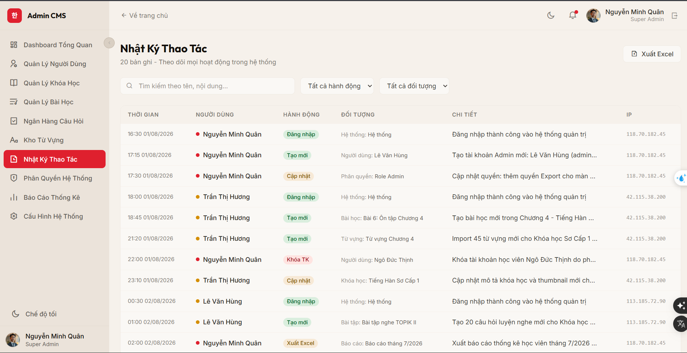
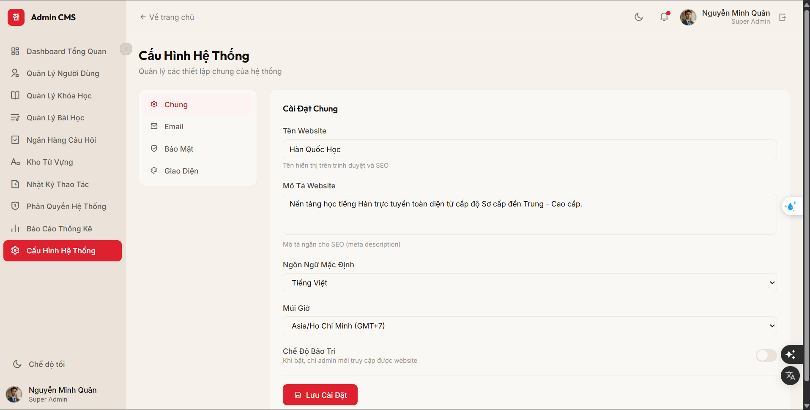

# Kế Hoạch Sprint 2: Phát Triển Giao Diện Quản Trị (Admin CMS UI/UX & Charts)
**Dự án:** Website Học Tiếng Hàn Trực Tuyến
**Thời gian:** 1 tuần
**Mục tiêu:** Phát triển toàn bộ giao diện quản trị (Admin CMS) đồng bộ với thiết kế UI học viên (Seoul sunset style, góc bo tròn, màu đỏ làm điểm nhấn, giao diện tối giản, hiện đại). Tích hợp các biểu đồ phân tích dữ liệu, báo cáo thống kê trực quan nhằm nâng cao trải nghiệm quản trị hệ thống.

---

## Danh Sách Tác Vụ Chi Tiết (Sprint Backlog)

### Phân Hệ 1: Khung Quản Trị & Dashboard (Admin Shell & Overview)

#### `SP2-CMS-01`: Xây dựng Layout Admin CMS & Sidebar Điều Hướng
* **Hình ảnh giao diện minh họa:**
  
* **Mô tả:** Thiết lập cấu trúc bố cục (Layout) chung cho phân hệ quản trị. Tích hợp Sidebar điều hướng bên trái và Header điều khiển phía trên. Hỗ trợ thay đổi giao diện Sáng/Tối (Light/Dark mode) riêng cho quản trị viên và responsive linh hoạt.
* **Nội dung thực hiện:**
  1. **Sidebar:** Logo thương hiệu "Admin CMS", danh sách 10 menu chức năng có icon tương ứng (Sử dụng `lucide-react`). Hỗ trợ thu gọn (collapse) Sidebar để tối ưu không gian làm việc. Phần chân Sidebar hiển thị công tắc chuyển Chế độ tối và thông tin tài khoản admin đang đăng nhập.
  2. **Header:** Nút điều hướng "Về trang chủ", chuông thông báo, menu cá nhân nhanh của Admin (Avatar, Họ tên, Vai trò) và nút Đăng xuất.
  3. **Responsive:** Tự động thu Sidebar thành Hamburger menu hoặc ngăn kéo trượt (Drawer) trên thiết bị Tablet/Mobile.
* **Định nghĩa hoàn thành (DoD):** Layout hiển thị nhất quán trên mọi trang admin, chuyển đổi sidebar và dark mode mượt mà, không xảy ra xung đột CSS với giao diện học viên.
* **Độ ưu tiên:** Cao (Blocker)
* **Thời gian ước tính:** 6 giờ

#### `SP2-CMS-02`: Trang Dashboard Tổng Quan (Overview Dashboard)
* **Hình ảnh giao diện minh họa:**
  
* **Mô tả:** Thiết kế màn hình trang chủ quản trị hiển thị các chỉ số hoạt động cốt lõi, nhật ký hoạt động gần đây và danh sách học viên mới tham gia.
* **Nội dung thực hiện:**
  1. **KPI Cards:** Thiết kế 4 thẻ chỉ số chính (Tổng Học Viên, Khóa Học, Lượt Xem Hôm Nay, Đăng Nhập Hôm Nay) sử dụng thiết kế hộp kem nhạt/trắng ngà, bo góc `rounded-2xl`, kèm icon màu pastel và thông số tăng trưởng (+% hoạt động).
  2. **Hoạt Động Gần Đây:** Bảng hiển thị danh sách 5-10 hành động mới nhất của các admin và hệ thống (thêm bài học, khóa tài khoản, đăng nhập...) sắp xếp theo thời gian thực.
  3. **Học Viên Mới:** Cột hiển thị danh sách các học viên mới đăng ký kèm cấp độ TOPIK mục tiêu và đèn tín hiệu trạng thái trực tuyến (online/offline).
* **DoD:** Các liên kết chuyển đổi giữa các module hoạt động chính xác; giao diện responsive tự động chuyển từ dạng Grid sang List dọc trên mobile.
* **Độ ưu tiên:** Cao
* **Thời gian ước tính:** 6 giờ

---

### Phân Hệ 2: Quản Lý Người Dùng & Quyền Hạn (User & Access Control)

#### `SP2-CMS-03`: Trang Quản Lý Người Dùng (User Management)
* **Hình ảnh giao diện minh họa:**
  
* **Mô tả:** Giao diện quản lý danh sách toàn bộ học viên và các tài khoản quản trị trong hệ thống. Hỗ trợ tìm kiếm, lọc nhanh và các thao tác tài khoản.
* **Nội dung thực hiện:**
  1. **Thanh Công Cụ:** Thiết kế ô tìm kiếm thông minh (theo tên, email), bộ lọc theo Trạng thái (Hoạt động, Đã khóa) và bộ lọc Vai trò (Super Admin, Admin, Học Viên). Nút "Xuất Excel" nằm ở góc phải.
  2. **Bảng Danh Sách:** Hiển thị thông tin cột rõ ràng: Ảnh đại diện + Họ tên, Email, Vai trò (với thẻ màu phân biệt), Cấp độ TOPIK hiện tại, Ngày tạo tài khoản, Trạng thái (Hoạt động - xanh, Đã khóa - đỏ).
  3. **Thao Tác:** Các nút chức năng xem thông tin chi tiết và khóa/mở khóa tài khoản nhanh.
* **DoD:** Phân trang hoạt động tốt, responsive chuyển sang dạng thẻ cuộn (Cards) trên màn hình nhỏ dưới 768px.
* **Độ ưu tiên:** Cao
* **Thời gian ước tính:** 5 giờ

#### `SP2-CMS-04`: Trang Phân Quyền Hệ Thống (Roles & Permissions Matrix)
* **Hình ảnh giao diện minh họa:**
  
* **Mô tả:** Màn hình cấu hình chi tiết quyền hạn truy cập của từng nhóm vai trò đối với các chức năng và màn hình trong hệ thống.
* **Nội dung thực hiện:**
  1. **Bộ Chọn Vai Trò:** Thiết kế tab lớn nằm ngang để admin lựa chọn nhanh giữa các vai trò (Super Admin, Admin, Học Viên) kèm mô tả ngắn gọn về quyền hạn cơ bản.
  2. **Ma Trận Quyền Hạn:** Bảng lưới ma trận gồm danh sách 10 màn hình (hàng ngang) và các quyền thao tác (XEM, TẠO, SỬA, XÓA, EXPORT, IMPORT - cột dọc). Sử dụng các ô checkbox bo tròn màu xanh dễ tương tác.
  3. **Phạm Vi Dữ Liệu & Danh Sách Thành Viên:** Thiết kế thanh bên phải hiển thị phạm vi tác động dữ liệu (Toàn bộ hệ thống, Dữ liệu giới hạn) và danh sách Avatar các admin đang sở hữu vai trò được chọn.
* **DoD:** Cập nhật trạng thái phân quyền lập tức khi tích chọn (hoặc hiện nút Lưu thay đổi), giao diện trực quan dễ nhìn trên màn hình lớn.
* **Độ ưu tiên:** Trung bình
* **Thời gian ước tính:** 6 giờ

---

### Phân Hệ 3: Quản Lý Nội Dung Đào Tạo (CMS Learning Content)

#### `SP2-CMS-05`: Trang Quản Lý Khóa Học (Course Management)
* **Hình ảnh giao diện minh họa:**
  
* **Mô tả:** Giao diện danh sách các khóa học hiện có dưới dạng lưới thẻ trực quan, cho phép quản lý vòng đời khóa học.
* **Nội dung thực hiện:**
  1. **Thanh Tiêu Đề:** Nút "Thêm Khóa Học" màu đỏ nổi bật kích hoạt modal/form thêm mới. Ô tìm kiếm khóa học và dropdown lọc theo cấp độ (TOPIK I, TOPIK II).
  2. **Lưới Thẻ Khóa Học (Course Grid):** Mỗi khóa học hiển thị dưới dạng card bao gồm ảnh thumbnail, huy hiệu tag cấp độ, tag trạng thái (Đã xuất bản/Bản nháp), mô tả ngắn gọn, thông số (số bài học, số học viên, số tuần học).
  3. **Thao Tác Nhanh:** Tích hợp nút "Chỉnh sửa" cấu hình chung và nút "Quản lý bài học" để chuyển sâu vào danh sách bài học thuộc khóa học đó.
* **DoD:** Lưới responsive tự động chuyển từ 3 cột (desktop) -> 2 cột (tablet) -> 1 cột (mobile), thẻ card có shadow mịn và hover scale nhẹ.
* **Độ ưu tiên:** Cao
* **Thời gian ước tính:** 5 giờ

#### `SP2-CMS-06`: Trang Quản Lý Bài Học (Lesson Management)
* **Hình ảnh giao diện minh họa:**
  
* **Mô tả:** Quản lý chi tiết danh sách các bài học video, lý thuyết thuộc từng chương của các khóa học.
* **Nội dung thực hiện:**
  1. **Bộ Lọc Phân Cấp:** Cho phép tìm kiếm bài học, lọc theo Khóa học chủ quản, lọc theo Chương học cụ thể và Trạng thái xuất bản.
  2. **Bảng Danh Sách Bài Học:** Hiển thị số thứ tự, Tên bài học (Tiếng Việt + Tiếng Hàn), Khóa học liên kết, Chương, Thời lượng (phút), Trạng thái, Ngày cập nhật và cột Thao tác (Xem, Sửa, Xóa).
  3. **Huy Hiệu Xem Thử:** Hiển thị thẻ tag màu xanh lá "Xem thử" bên cạnh bài học được phép học thử miễn phí.
* **DoD:** Cho phép tìm kiếm tức thì (Debounced search), giao diện bảng dữ liệu gọn gàng, nút xóa có cảnh báo xác nhận (confirm modal).
* **Độ ưu tiên:** Cao
* **Thời gian ước tính:** 6 giờ

#### `SP2-CMS-07`: Trang Ngân Hàng Câu Hỏi (Question Bank)
* **Hình ảnh giao diện minh họa:**
  
* **Mô tả:** Quản lý ngân hàng câu hỏi trắc nghiệm và bài tập thực hành liên kết với từng bài học cụ thể để phục vụ luyện tập.
* **Nội dung thực hiện:**
  1. **Bảng Bộ Câu Hỏi:** Danh sách các bộ câu hỏi ôn tập, hiển thị thông tin bài học liên kết, loại câu hỏi, số lượng câu (ví dụ 10 câu), thời gian làm bài (phút), điểm số tối thiểu để đỗ (Pass rate % hiển thị dạng badge nổi bật).
  2. **Bộ Lọc & Tìm Kiếm:** Lọc theo Loại câu hỏi (Từ vựng, Ngữ pháp, Nghe, Đọc).
  3. **Thao Tác:** Các nút Xem danh sách câu hỏi chi tiết, Chỉnh sửa câu hỏi, và Thêm bộ câu hỏi mới.
* **DoD:** Bảng dữ liệu căn lề chuẩn xác, hiển thị màu sắc tiến trình điểm đỗ trực quan (ví dụ điểm đỗ cao màu xanh, thấp màu cam).
* **Độ ưu tiên:** Cao
* **Thời gian ước tính:** 6 giờ

#### `SP2-CMS-08`: Trang Kho Từ Vựng (Vocabulary Repository)
* **Hình ảnh giao diện minh họa:**
  
* **Mô tả:** Quản lý toàn bộ danh sách từ vựng tiếng Hàn kèm phiên âm, nghĩa dịch, và bài học tương ứng trong hệ thống. Hỗ trợ nhập xuất file hàng loạt.
* **Nội dung thực hiện:**
  1. **Nhập/Xuất Dữ Liệu:** Thiết kế nút "Nhập Excel" và "Thêm Từ Vựng" ở thanh công cụ.
  2. **Thống Kê Nhanh:** Hiển thị các chỉ số mini ở trên cùng (Tổng từ vựng, Số khóa học, Số bài học có từ vựng, Độ dài trung bình của từ).
  3. **Bảng Từ Vựng:** Hiển thị các cột Từ vựng (Tiếng Hàn cỡ chữ lớn và đậm nét), Phiên âm (dạng IPA hoặc phiên âm la-tinh), Nghĩa tiếng Việt, Bài học, Khóa học liên kết.
* **DoD:** Nhập excel hỗ trợ hiển thị danh sách xem trước (preview) trước khi lưu chính thức vào cơ sở dữ liệu.
* **Độ ưu tiên:** Trung bình
* **Thời gian ước tính:** 6 giờ

---

### Phân Hệ 4: Biểu Đồ Thống Kê & Cấu Hình (Analytics & System Settings)

#### `SP2-CMS-09`: Trang Báo Cáo Thống Kê (Advanced Analytics) & Đề Xuất Cải Tiến Biểu Đồ
* **Hình ảnh giao diện minh họa:**
  
* **Mô tả:** Xây dựng màn hình phân tích số liệu học tập của học viên, hiệu suất khóa học và bổ sung các biểu đồ trực quan cao cấp (sử dụng thư viện `Recharts` hoặc `Chart.js`).
* **Nội dung thực hiện:**
  1. **KPI Analytics Cards:** Hiển thị Tổng Học Viên, Tổng Khóa Học, Điểm Quiz Trung Bình (%), Chuỗi Ngày Học Liên Tục Trung Bình (Streak).
  2. **Biểu Đồ Hiện Tại:**
     * **Phân Bố Học Viên:** Biểu đồ thanh ngang (Horizontal Bar Chart) phân loại trạng thái học viên (Đang hoạt động, Đã khóa, Không hoạt động).
     * **Hiệu Suất Khóa Học:** Bảng tiến độ phần trăm hoàn thành khóa học trung bình của học viên.
  3. **[CẢI TIẾN THÊM BIỂU ĐỒ & SỐ LIỆU ĐỀ XUẤT]:**
     * **Biểu Đồ Xu Hướng Đăng Ký Học (Line Chart):** Thống kê số lượng học viên đăng ký mới theo các mốc thời gian (Tuần, Tháng, Quý) để admin đánh giá hiệu quả marketing/nội dung.
     * **Biểu Đồ Tròn Tỷ Lệ Cấp Độ Học (Donut Chart):** Phân tích tỷ lệ học viên đang tập trung học ở phân khúc nào (TOPIK I Cấp 1, Cấp 2, TOPIK II Cấp 3, Cấp 4, Cấp 5, Cấp 6) giúp định hướng sản xuất nội dung bài giảng mới.
     * **Biểu Đồ Cột Hoạt Động Hàng Ngày (Bar Chart):** Thống kê lượng truy cập và thời gian học trung bình theo các khung giờ hoặc ngày trong tuần nhằm tối ưu hóa hạ tầng và thời gian đẩy thông báo đẩy (push notification).
     * **Biểu Đồ Radar Đánh Giá Kỹ Năng (Radar Chart):** Trực quan hóa điểm số trung bình của học viên trên 4 kỹ năng (Nghe - Lấy thông tin, Đọc - Hiểu ngữ cảnh, Từ vựng - Ngữ pháp, Viết) dựa trên kết quả các bài Quiz, giúp giáo viên tìm ra kỹ năng học viên còn yếu để bổ sung bài tập bổ trợ.
     * **Biểu Đồ Phễu Tỷ Lệ Chuyển Đổi (Funnel Chart):** Thống kê tỷ lệ rơi rớt của học viên qua các bước học tập (Đăng ký tài khoản -> Click vào khóa học -> Học bài đầu tiên -> Làm bài test đầu tiên -> Hoàn thành khóa học).
* **DoD:** Tích hợp thành công thư viện biểu đồ, dữ liệu hiển thị động, responsive mượt mà không bị méo biểu đồ trên mobile, hỗ trợ tương tác rê chuột (tooltip) hiển thị thông số chi tiết.
* **Độ ưu tiên:** Cao
* **Thời gian ước tính:** 10 giờ

#### `SP2-CMS-10`: Trang Cấu Hình Hệ Thống & Nhật Ký Thao Tác (System Settings & Audit Log)
* **Hình ảnh giao diện minh họa:**
  
  
* **Mô tả:** Thiết lập cấu hình hệ thống chung và theo dõi lịch sử hoạt động bảo mật của các tài khoản quản trị viên.
* **Nội dung thực hiện:**
  1. **Cấu Hình Hệ Thống:** Thiết kế tab dọc gồm Chung (Tên web, Mô tả SEO, ngôn ngữ, múi giờ, chế độ bảo trì), Email (Cấu hình SMTP), Bảo Mật (Đổi mật khẩu, xác thực 2 lớp), Giao Diện (Thiết lập màu chủ đạo, logo chân trang).
  2. **Nhật Ký Thao Tác (Audit Log):** Bảng hiển thị thông tin bảo mật bao gồm Thời gian hành động, Tên người dùng thực hiện (kèm thẻ màu chỉ định vai trò), Loại hành động (Đăng nhập, Tạo mới, Cập nhật, Khóa tài khoản, Xuất Excel), Đối tượng chịu tác động, Chi tiết nội dung và Địa chỉ IP truy cập.
* **DoD:** Các thiết lập lưu thành công và cập nhật ngay lập tức cấu hình hệ thống (như thay đổi mô tả SEO hoặc bật/tắt chế độ bảo trì), trang Audit Log hỗ trợ lọc hành động và tìm kiếm nhanh.
* **Độ ưu tiên:** Trung bình
* **Thời gian ước tính:** 6 giờ

---

## Tóm Tắt Ước Lượng Sprint 2
* **Tổng số tác vụ:** 10 tác vụ chính (CMS Shell, Dashboard, 6 trang quản lý nội dung/thành viên, Báo cáo biểu đồ nâng cao, Thiết lập & Log).
* **Tổng thời gian ước tính:** 62 giờ (Tương đương 1.5 tuần làm việc tập trung của lập trình viên)
* **Quy ước đặt mã:** `SP2-CMS-[Số thứ tự]` (SP2 = Sprint 2, CMS = Hệ thống quản trị nội dung)
